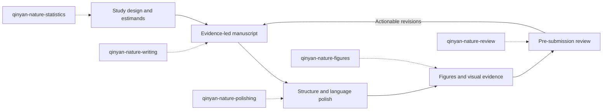

# Qinyan Nature Skills

**Nature-style scientific writing, manuscript polishing, pre-submission peer review, publication figures, and statistical analysis for AI coding agents.**

[Back to README](./README.md) · [简体中文 README](./README.zh-CN.md) · [Browse all Qinyan skills](./skills/沁言学术skills/)

Qinyan Nature Skills is a five-part academic workflow for researchers who want a concise, evidence-led and technically defensible manuscript. Each skill has a narrow responsibility, an explicit output contract, focused reference material, and a deterministic audit script.

> [!IMPORTANT]
> “Nature-style” describes editorial and scientific communication goals such as broad significance, concise argumentation, evidence discipline, reproducible figures, and transparent statistics. This independent open-source project is not affiliated with or endorsed by Nature Portfolio or Springer Nature and cannot guarantee editorial review or acceptance.

## Choose the right skill

| If you need to… | Start with | What it protects |
| --- | --- | --- |
| Turn results into a coherent manuscript argument | [`qinyan-nature-writing`](./skills/沁言学术skills/qinyan-nature-writing/) | Claim–evidence alignment, narrative logic, section purpose |
| Improve structure, clarity, flow, or academic English | [`qinyan-nature-polishing`](./skills/沁言学术skills/qinyan-nature-polishing/) | Scientific meaning, calibrated certainty, authorial intent |
| Review a manuscript before journal submission | [`qinyan-nature-review`](./skills/沁言学术skills/qinyan-nature-review/) | Traceability, issue prioritization, conceptual and technical coverage |
| Design or quality-check publication figures | [`qinyan-nature-figures`](./skills/沁言学术skills/qinyan-nature-figures/) | Reproducibility, visual hierarchy, accessibility, export integrity |
| Plan, audit, or report statistical analyses | [`qinyan-nature-statistics`](./skills/沁言学术skills/qinyan-nature-statistics/) | Design integrity, estimand clarity, uncertainty, complete reporting |

## End-to-end manuscript workflow



The skills are composable rather than monolithic. Use only the component needed for the current task, or run the full sequence when preparing a complete submission.

## Install

The installer supports Claude Code, Cursor, Codex, Gemini CLI, OpenClaw, and OpenCode.

### Install one Nature skill

```bash
curl -fsSL https://raw.githubusercontent.com/LeonChaoX/qinyan-academic-skills/main/install.sh \
  | bash -s -- --skill qinyan-nature-writing
```

Replace `qinyan-nature-writing` with any skill name in the table above.

### Install the complete Nature suite

```bash
INSTALLER="https://raw.githubusercontent.com/LeonChaoX/qinyan-academic-skills/main/install.sh"

for skill in \
  qinyan-nature-writing \
  qinyan-nature-polishing \
  qinyan-nature-review \
  qinyan-nature-figures \
  qinyan-nature-statistics
do
  curl -fsSL "$INSTALLER" | bash -s -- --skill "$skill"
done
```

Add `--tool codex`, `--tool cursor`, or another supported tool to target a different agent. Add `--project` to install inside the current project instead of globally.

## What makes the suite rigorous

### Evidence before eloquence

The writing and polishing skills separate verified evidence, author interpretation, and unresolved uncertainty. They do not invent citations, results, mechanisms, or methodological details to make prose sound more persuasive.

### Meaning-preserving revision

Polishing is treated as a constrained transformation. The revised text must retain the original scientific claim, direction of effect, population, conditions, uncertainty, and citation relationship unless the researcher explicitly asks for a substantive rewrite.

### Traceable review

Review findings use stable identifiers, severity, evidence, consequence, and a concrete revision path. This makes reviewer-style feedback easier to discuss, resolve, and re-check across manuscript versions.

### Reproducible visual evidence

Figure work begins with a figure contract: scientific question, data source, transformation, visual encoding, statistical annotation, accessibility, and export requirements. The preflight script checks common production defects before submission.

### Design-aware statistics

Statistical guidance starts from the research question, experimental unit, dependency structure, estimand, and missingness mechanism. Reporting emphasizes effect sizes and uncertainty rather than treating a thresholded p-value as the conclusion.

## Example requests

### Scientific writing

> Use `qinyan-nature-writing` to turn these results and verified references into a concise Results section. Build a claim–evidence map first, flag unsupported transitions, and do not invent citations.

### Manuscript polishing

> Use `qinyan-nature-polishing` to revise this abstract for Nature-style clarity and compression. Preserve every numerical result and uncertainty statement, then provide a short change log.

### Pre-submission review

> Use `qinyan-nature-review` to review this manuscript as a skeptical interdisciplinary reader. Separate blocking issues from optional improvements and assign stable issue IDs.

### Scientific figures

> Use `qinyan-nature-figures` to design a four-panel figure that supports the central claim. Specify the data-to-mark mapping, statistical annotations, color-accessibility checks, and export settings before rendering.

### Statistical analysis

> Use `qinyan-nature-statistics` to audit this analysis plan. Identify the experimental unit, estimand, dependency structure, multiplicity strategy, missing-data assumptions, and minimum reporting set.

## Quality gates and scripts

| Skill | Deterministic check |
| --- | --- |
| `qinyan-nature-writing` | `scripts/manuscript_audit.py` checks manuscript structure and required reporting elements |
| `qinyan-nature-polishing` | `scripts/style_audit.py` flags avoidable style and consistency problems |
| `qinyan-nature-review` | `scripts/review_consistency.py` validates review issue structure and identifiers |
| `qinyan-nature-figures` | `scripts/figure_preflight.py` checks figure dimensions, resolution, format, and production risks |
| `qinyan-nature-statistics` | `scripts/reporting_audit.py` checks statistical reporting completeness |

These scripts provide deterministic guardrails; they do not replace domain expertise, statistical consultation, journal instructions, or human editorial judgment.

## 中文简介

沁言 Nature Skills 是一套面向高水平论文工作流的五技能组合，覆盖：

- Nature 风格科学论文写作与论证组织
- 中英文学术论文结构优化和专业润色
- 投稿前同行评审式审查与问题追踪
- 可复现、多面板、投稿级科研绘图
- 研究设计、统计分析、结果报告与完整性审计

每个 Skill 都包含独立的 `SKILL.md`、针对性参考资料、可复用脚本和明确的质量门槛。它们强调证据真实性、科学含义保持、不过度推断、统计透明与视觉可复现性。

## Attribution

The workflow categories were informed by the Apache-2.0-licensed [`Yuan1z0825/nature-skills`](https://github.com/Yuan1z0825/nature-skills) project. The Qinyan suite independently rewrites and extends the architecture, instructions, references, quality contracts, and audit tooling. See each skill for detailed source and license metadata.
